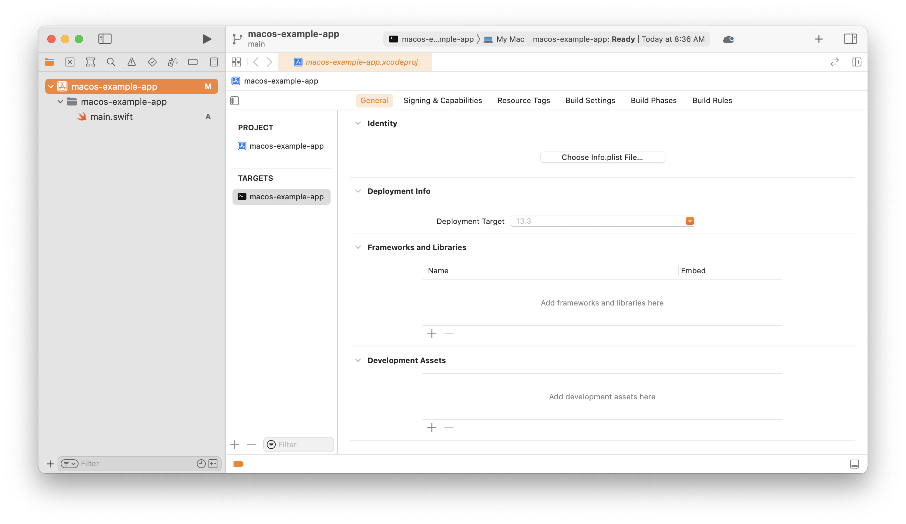
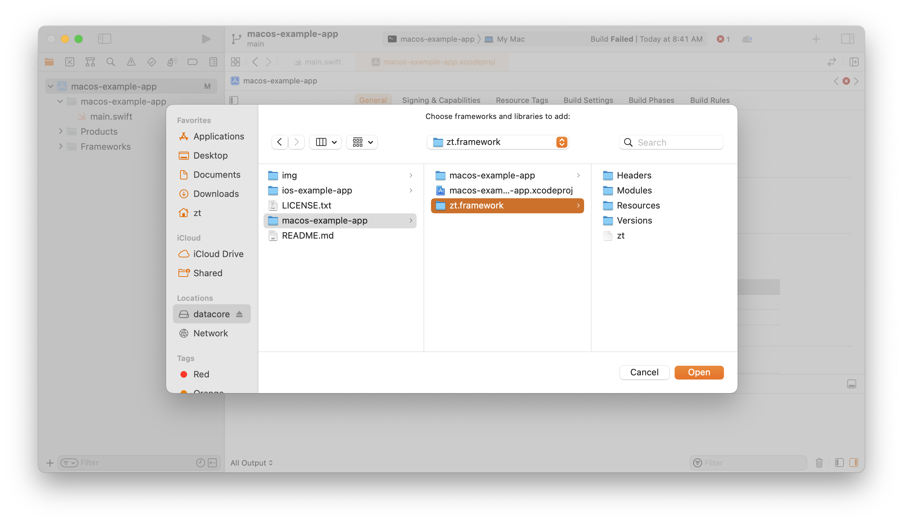
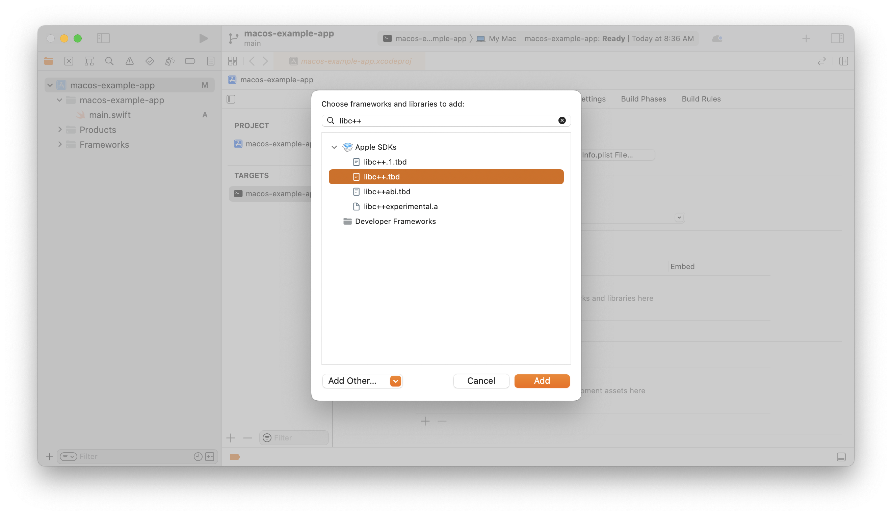
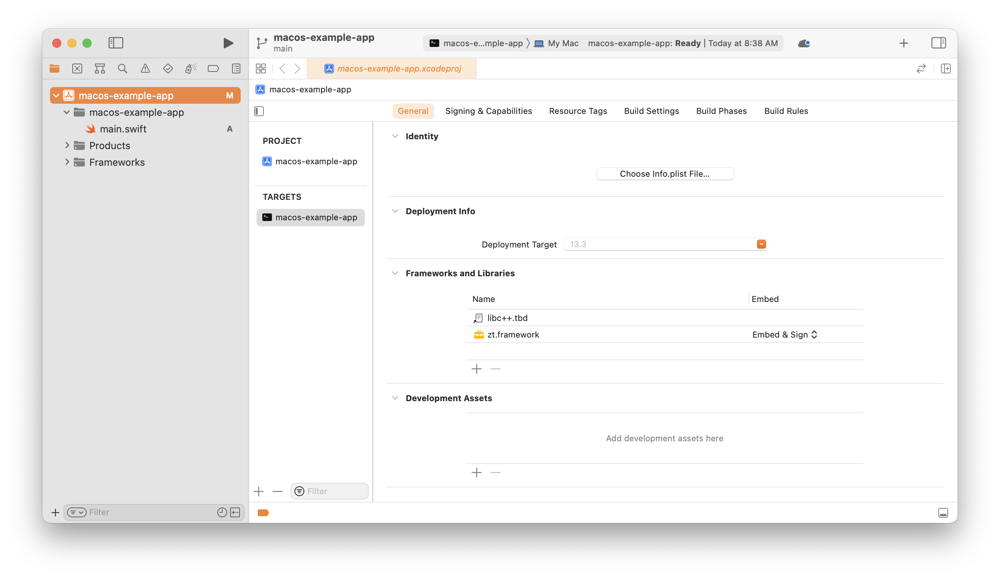
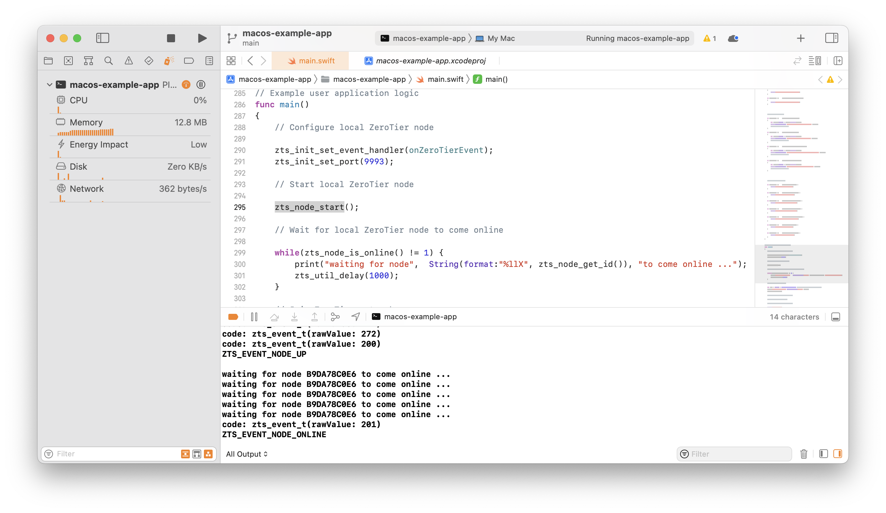

# sdk-ios-macos-ipados

Demonstration of how to use a ZeroTier node in your macOS, iOS, iPadOS Swift or Objective-C application. `main.swift` contains example code that shows how to start and stop a node, handle events, and open a basic BSD-style socket that can connect to resources on your ZeroTier virtual network.

## Get the ZeroTier framework

Use the example frameworks in this repo or download the latest here: [zerotier.com/download/](https://www.zerotier.com/download/)

## How to add the ZeroTier framework to your project

Navigate to `App -> Overview -> Frameworks and Libraries`

Add `zt.framework` by clicking the `+` icon and then the `Add Other` dropdown in the dialog window. Navigate to the `zt.framework` file and select it. Our framework is just a folder with a static library and some metadata.

Add `libc++.tbd` (Required by ZeroTier)

You should now have a list with two items:

Add your code to `main.swift`. Then build and run:

After a few moments you should see some output in your console showing details about the node, its state, whether it joined a network, etc.

## Low-level socket API

While this example is written in Swift it is basically just calling C functions. More examples can be found here: [libzt/examples/c](https://github.com/zerotier/libzt/tree/main/examples/c). These same functions can be called from Objective-C code as well.

## Higher level API (NSStream / URLSession)

A higher level API is currently under development but not yet released. If you'd like to help out please [get in touch with us!]()
